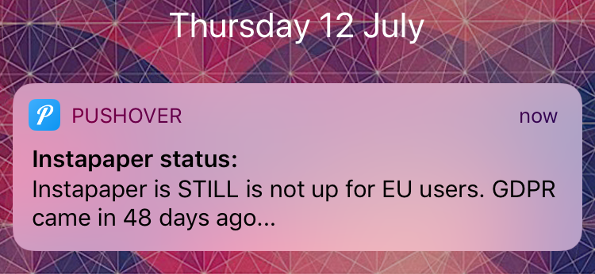

# Instapaper Status 

> Check if Instapaper is _still_ down, and report this to Pushover 

I'm getting sick of checking if Instapaper is back online for us in the EU. This simple utility will tell me every day if I can use it again. Bets on how big this number gets?

## Usage

* Clone the project
* `pipenv install`
* `pipenv shell`
* `python instapaper_checker.py`
	* expects a [python-pushover config file](https://github.com/Thibauth/python-pushover#configuration) at `./pushoverrc`
* Schedule it however you like 👌

Uses [Requests](https://github.com/requests/requests), [Arrow](https://github.com/crsmithdev/arrow) and [python-pushover](https://github.com/Thibauth/python-pushover)

## Output 

